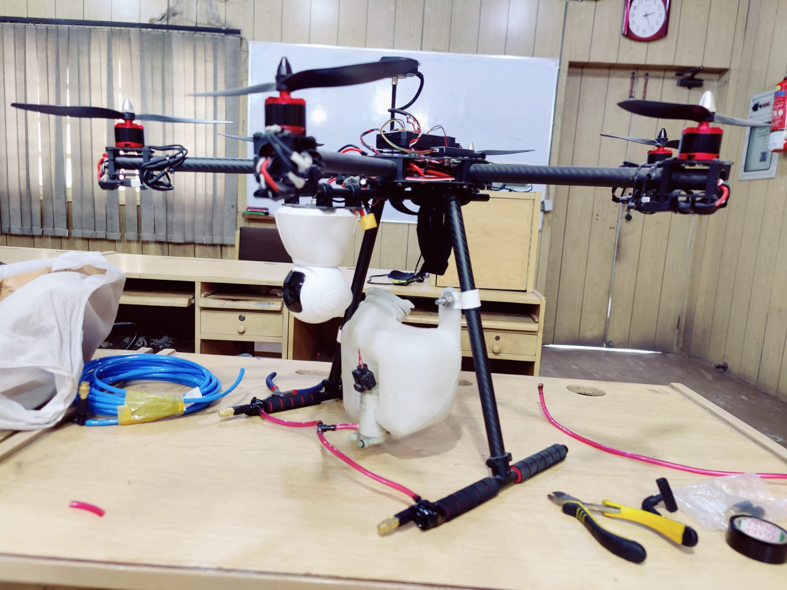
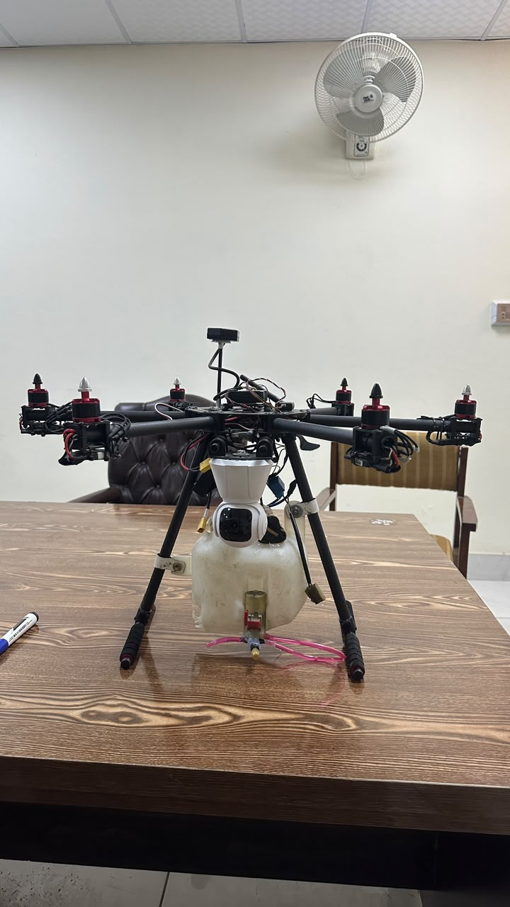
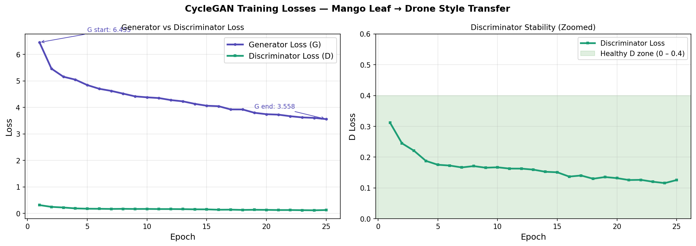
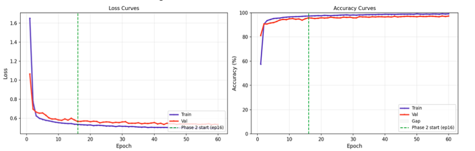
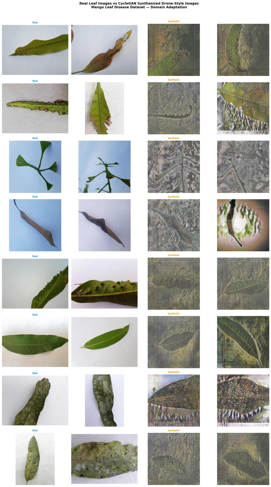

# Vision Transformer Driven Mango Leaf Disease Detection with Targeted Spraying Using UAV

**Authors:** Jamal Khan, Naveed Ahmad, Omer Khan  
**Supervisor:** Dr. Yasir Saleem Afridi  
**Department:** Computer Systems Engineering, University of Engineering and Technology (UET), Peshawar, Pakistan  
**Year:** 2022-2026

---

## Overview

Mango is one of the most economically important fruit crops in Pakistan. Leaf diseases such as Anthracnose, Powdery Mildew, Bacterial Canker, Dieback, Gall Midge, Cutting Weevil, and Sooty Mould cause severe yield and quality losses.

This project presents a **Vision Transformer (DeiT-Small)** driven framework for mango leaf disease detection integrated with a **custom hexacopter UAV** for targeted pesticide spraying. CycleGAN-based domain adaptation generates drone-style synthetic images to bridge the gap between ground-level datasets and aerial deployment.

---

## Hardware — Hexacopter UAV

  
  &nbsp;&nbsp;
  

Custom hexacopter with 6x brushless motors on carbon fiber booms, integrated camera gimbal, translucent spray tank with relay-driven pump, GPS geo-tagging for treatment maps. Flight altitude: 10-30 m above canopy.

See [docs/hardware.md](docs/hardware.md) for full specifications.

---

## Sample Videos

| Video | Description |
|-------|-------------|
| [drone_video.mp4](data/samples/videos/drone_video.mp4) | Drone flight over mango orchard |
| [targeted_spraying.mp4](data/samples/videos/targeted_spraying.mp4) | Targeted spraying mechanism |
| [video_1.mp4](data/samples/videos/video_1.mp4) | Additional field footage |

---

## Disease Classes (8)

| # | Class | Visual Symptom |
|---|-------|----------------|
| 1 | Anthracnose | Dark angular necrotic lesions |
| 2 | Bacterial Canker | Water-soaked halos |
| 3 | Cutting Weevil | Cut leaf edges |
| 4 | Dieback | Brown wilting from tip |
| 5 | Gall Midge | Curled / galled leaves |
| 6 | Healthy | Normal green leaf |
| 7 | Powdery Mildew | White powdery patches |
| 8 | Sooty Mould | Black soot-like coating |

---

## Model

**DeiT-Small** (`deit_small_patch16_224`) + custom **LayerNorm classification head**

- 12 transformer blocks, 384 embedding dim, 6 attention heads
- 196 patches (16x16) + 1 CLS token
- ~22M parameters, ImageNet-1k pretrained

Custom head: LN(384) -> Linear(384->256) -> LN -> GELU -> Drop(0.25) -> Linear(256->128) -> LN -> GELU -> Drop(0.15) -> Linear(128->8)

---

## Training Strategy

Two-phase progressive unfreezing:

| Phase | Epochs | Trainable | LR | WD |
|-------|--------|-----------|-----|-----|
| 1 | 1-30 | Head only | 5e-4 | 0.05 |
| 2 | 31-60 | Head + top-2 blocks | 5e-4 / 1e-6 | 0.10 |

Key design choices:
- No Mixup (proven to cause fake 9-13% train/val gap)
- Micro backbone LR (1e-6) to prevent overfitting
- Label smoothing 0.1, stochastic depth 0.1, attention dropout 0.1
- Gradient clipping (max_norm=1.0), early stopping (patience=15)

---

## Results

| Metric | Value |
|--------|-------|
| Best Validation Accuracy | **97.09%** (epoch 59) |
| Final Training Accuracy | 98.90% |
| Final Validation Accuracy | 96.70% |
| Max Train/Val Gap | less than 3% |
| Test Accuracy | 100% (thesis) / 98% (paper) |
| Training Time | 5.57 h (Kaggle P100) |
| Model Size | 117 MB |

### CycleGAN Training

  

### Training Curves

  

### Real vs Synthetic Domain Adaptation

  

See [docs/results.md](docs/results.md) for ablation studies.

---

## Repository Structure
mango-disease-uav/
├── data/
│ ├── samples/videos/
│ ├── raw_images/
│ └── raw_videos/
├── src/
│ ├── train.py
│ └── utils/
│ └── extract_frames.py
├── results/
│ ├── plots/
│ └── logs/
└── docs/
├── hardware.md
├── dataset.md
├── results.md
├── project_summary.md
├── hardware/
├── paper/
└── figures/

text

---

## Quick Start
git clone https://github.com/omerkhanok/mango-disease-uav.git
cd mango-disease-uav
pip install -r requirements.txt

text

### Train
python src/train.py

text

(Paths inside train.py point to Kaggle directories — update for local runs.)

### Extract frames from drone video
python src/utils/extract_frames.py --video data/samples/videos/drone_video.mp4 --output data/processed/frames --fps 1

text

---

## Dataset

**MangoLeafBD** — 4,000 images, 8 classes, balanced (500/class). Split 65/20/15 stratified.

**CycleGAN synthetic** — 1,600 images (200/class), split into train and validation.

**After augmentation (x3):** ~10,173 train / ~4,800 val images.

Two-stage leakage audit: MD5 hash + ResNet-18 embedding cosine similarity (threshold >= 0.95).

See [docs/dataset.md](docs/dataset.md).

---

## Citation
@misc{khan2026mangodisease,
title={Vision Transformer Driven Mango Leaf Disease Detection with Targeted Spraying Using UAV},
author={Khan, Jamal and Ahmad, Naveed and Khan, Omer and Afridi, Yasir Saleem},
year={2026},
institution={University of Engineering and Technology, Peshawar}
}

text

---

## License

MIT — see [LICENSE](LICENSE).
